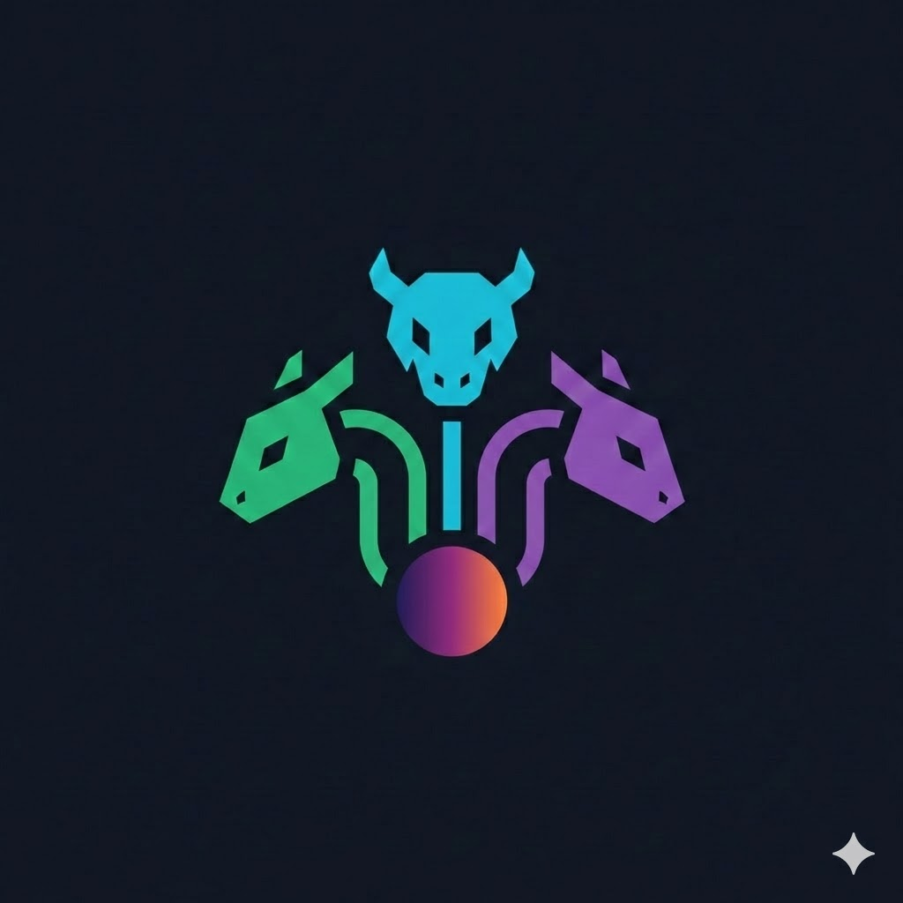

<p align="center">
  
</p>

<h1 align="center">HydraMCP</h1>
<p align="center">Connect agents to agents.</p>

An MCP server that lets Claude Code query any LLM through your existing subscriptions. No extra API keys, no per-token billing. Just your monthly subscriptions working together from one terminal.

## What It Looks Like

Four models, four ecosystems, one prompt. This is real output from a live session:

```
> compare gpt-5-codex, gemini-3, claude-sonnet, and local qwen on this function review

## Model Comparison (4 models, 11637ms total)

| Model                      | Latency         | Tokens |
|----------------------------|-----------------|--------|
| gpt-5-codex                | 1630ms fastest  | 194    |
| gemini-3-pro-preview       | 11636ms         | 1235   |
| claude-sonnet-4-5-20250929 | 3010ms          | 202    |
| ollama/qwen2.5-coder:14b   | 8407ms          | 187    |
```

All four independently found the same async bug. Then each one caught something different the others missed. GPT-5 was fastest, Gemini was most thorough, Claude gave the fix direction, Qwen explained the why. Different training, different strengths, one comparison.

And this is consensus with a local judge:

```
> get consensus from gpt-5, gemini-3, and claude-sonnet. use local qwen as judge.

## Consensus: REACHED

Strategy: majority (needed 2/3)
Agreement: 3/3 models (100%)
Judge: ollama/qwen2.5-coder:14b (686ms)
```

Three cloud models polled, local model judging them. 686ms to evaluate agreement, no quota used.

## Five Tools

- **list_models** - See what's available across all your providers
- **ask_model** - Query any model and get a response back
- **compare_models** - Same prompt to 2-5 models in parallel, side by side with brief/detailed format
- **consensus** - Poll 3-7 models, a judge model evaluates agreement, returns one answer with a confidence score
- **synthesize** - Fan out to multiple models, then combine their best ideas into one answer that's better than any individual response

From inside Claude Code you just say things like:
- "ask gpt-5 to review this function"
- "compare gemini and claude on this approach"
- "get consensus from 3 models on whether this is thread safe"
- "synthesize responses from gpt-5, gemini, claude, and qwen on how to design this API"

It just works. No browser tabs, no copy pasting between apps.

## How It Works

```
You in Claude Code
    |
    HydraMCP (MCP Server)
    |
    Provider Interface
    |-- CLIProxyAPI  -> cloud models (OpenAI, Google, Anthropic, etc.)
    |-- Ollama       -> local models (your hardware)
    |-- [anything]   -> direct API, LM Studio, whatever speaks HTTP
```

HydraMCP sits between Claude Code and your model providers. It routes requests to the right backend, runs comparisons in parallel, and formats results to keep your context window small.

The consensus tool uses an LLM-as-judge approach. Instead of naive keyword matching, it picks a model not in the poll and has it evaluate whether the responses actually agree. It understands that "start with a monolith" and "monolith because it's simpler" are the same answer.

The synthesize tool goes further. It collects responses from multiple models, then a synthesizer model reads all of them and builds one combined answer. Best structure from one, best insights from another, best examples from a third. The result is better than any single model could produce alone.

## Setup

### Prerequisites

- Node.js 18+
- Claude Code
- At least one of:
  - [CLIProxyAPI](https://github.com/router-for-me/CLIProxyAPI) (for subscription-based cloud models)
  - [Ollama](https://ollama.com) (for local models)

### Install

```bash
git clone https://github.com/Pickle-Pixel/HydraMCP.git
cd HydraMCP
npm install
npm run build
```

### Configure

Copy the example env and fill in your details:

```bash
cp .env.example .env
```

```env
# CLIProxyAPI backend
CLIPROXYAPI_URL=http://localhost:8317
CLIPROXYAPI_KEY=your-key-here

# Ollama backend
OLLAMA_URL=http://localhost:11434
```

### Register with Claude Code

```bash
claude mcp add hydramcp -s user -- node /path/to/HydraMCP/dist/index.js
```

Restart Claude Code. HydraMCP will show up in your MCP tools.

### Model Routing

You can target specific backends with prefixes:

- `cliproxy/gpt-5` - explicitly use CLIProxyAPI
- `ollama/qwen2.5-coder:14b` - explicitly use Ollama
- `gpt-5` - auto-detect (tries each provider until one handles it)

## Credits

- [CLIProxyAPI](https://github.com/router-for-me/CLIProxyAPI) powers the subscription-based cloud backend
- [Ollama](https://ollama.com) powers the local model backend
- Built with the [MCP SDK](https://github.com/modelcontextprotocol/sdk) and [Zod](https://github.com/colinhacks/zod)

I built the MCP tool layer, routing logic, and multi-model orchestration on top of these. Credit where it's due.

## Contributing

Want to add a provider? The interface is simple. Check `src/providers/provider.ts` for the contract and `src/providers/ollama.ts` for a working example. Implement `healthCheck()`, `listModels()`, and `query()`, register it in `src/index.ts`, and you're done.

Providers we'd love to see:
- LM Studio
- OpenRouter
- Direct API keys (OpenAI, Anthropic, Google)
- Anything else that speaks HTTP

## License

MIT
